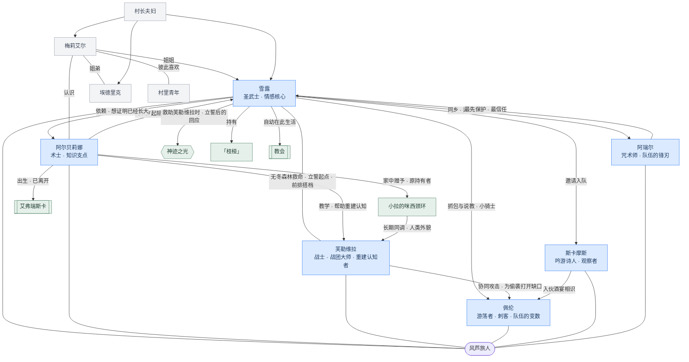

---
tags:
  - lore
  - index
---

# 风芦旅人 · 关系网

图中收录六名正式成员、主要 NPC 和与人物直接相关的设定，只展示已有资料明确支持的关系。

## 图例

- 蓝色节点表示六名正式成员
- 灰色节点表示梅莉艾尔、埃德里克、村长夫妇和村里青年
- 绿色节点表示[[神迹之光]]、[[「枝桠」]]、[[小拉的咪西颈环]]、[[教会]]和[[艾弗瑞斯卡 Evereska|艾弗瑞斯卡]]
- 图中连线均来自已确认资料

<!-- windreed:relationships:start -->
## 队伍归属

- 雪露、阿尔贝莉娜、芙勒维拉、佩伦、斯卡摩斯与阿瑞尔均为风芦旅人的正式成员。

## 核心人际

- **阿尔贝莉娜 → 雪露**：从雪露约五岁起陪伴并引导她。
- **雪露 → 阿尔贝莉娜**：依赖她，也想证明自己已经长大。
- **雪露 ↔ 芙勒维拉**：1490 DR 在无冬森林相遇；雪露拒绝放弃芙勒维拉，此后两人共同承担队伍前排。
- **阿尔贝莉娜 → 芙勒维拉**：教导她，帮助她重新建立语言、知识与常识。
- **雪露 → 佩伦**：抓包与说教；佩伦称她为“小骑士”。
- **雪露 → 斯卡摩斯**：邀请他进入队伍。
- **芙勒维拉 → 佩伦**：战斗中为他的偷袭打开缺口。
- **雪露 → 阿瑞尔**：两人来自同一地区，雪露邀请他进入队伍。
- **阿瑞尔 → 雪露**：最先保护、也最信任的人。

## 家庭与旧识

- **梅莉艾尔 → 雪露**：姐姐。
- **梅莉艾尔 ↔ 埃德里克**：姐弟。
- **梅莉艾尔 ↔ 阿尔贝莉娜**：彼此认识。

## 设定关联

- 雪露在救助芙勒维拉时先立下保护生命的誓言，随后见到局部的[[神迹之光]]；她也长期持有[[「枝桠」]]。
- 阿尔贝莉娜出生于[[艾弗瑞斯卡 Evereska|艾弗瑞斯卡]]，后来离开故乡，并将家中赠予的[[小拉的咪西颈环]]长期交给芙勒维拉同调。
- 芙勒维拉戴着[[小拉的咪西颈环]]时会呈现固定的人类外貌，以此进入城镇。
<!-- windreed:relationships:end -->
